# Đây là tên nè
> Là một ứng dụng thanh toán bằng phương thức quét mã QR với giao diện đơn giản, dễ sử dụng.

## Nội dung
* [Chức năng](#chức-năng)
* [Yêu cầu thiết bị](#yêu-cầu-thiết-bị)
* [Thư viện và công nghệ](#thư-viện-và-công-nghệ)
* [Tác giả](#tác-giả)

## Chức năng
### Quản lý tài khoản
* Đăng nhập

  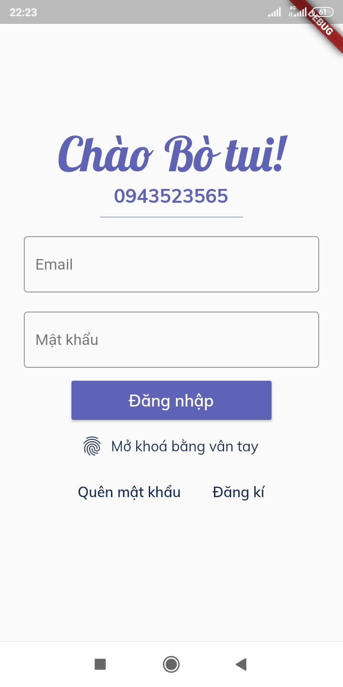
  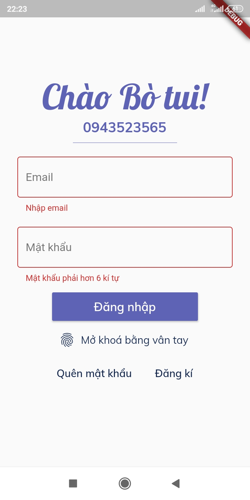 

* Đăng ký

  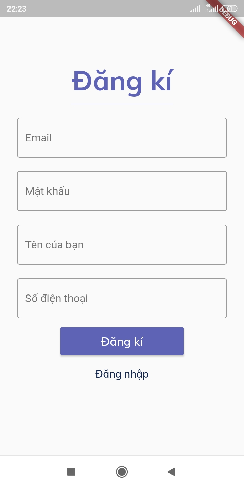
  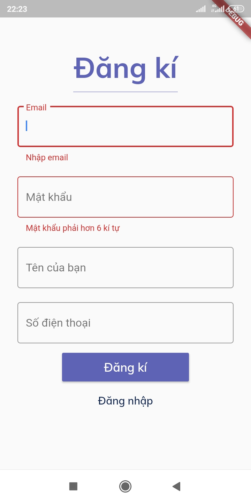 

### Trang chủ

  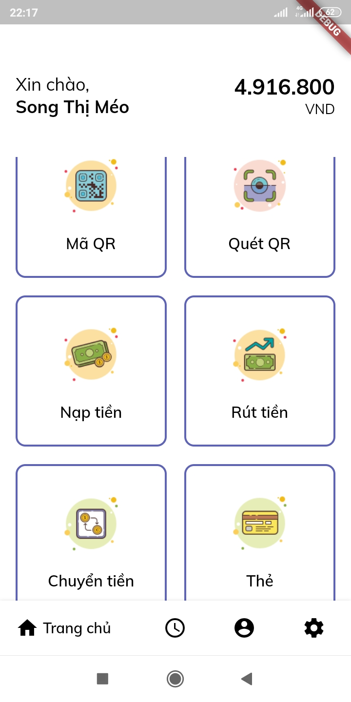

### Tạo, quét mã QR
* Tạo mã QR

  

* Quét mã QR

  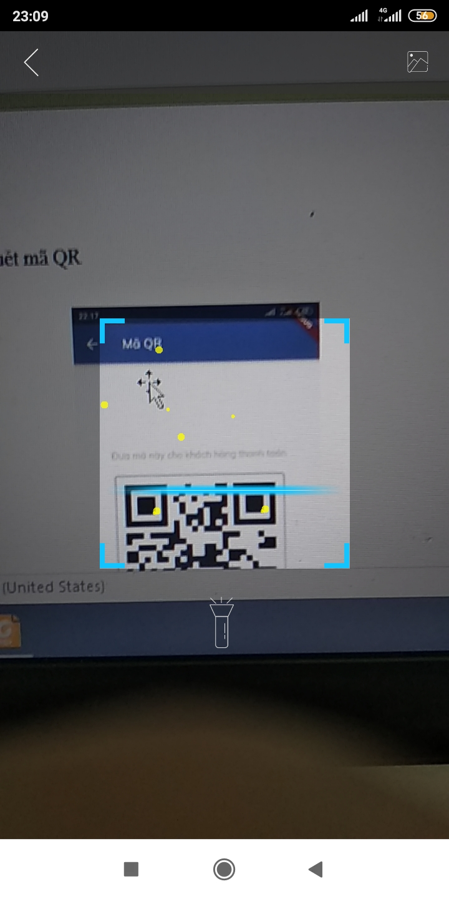

* Hiển thị thông tin người nhận sau khi quét QR

  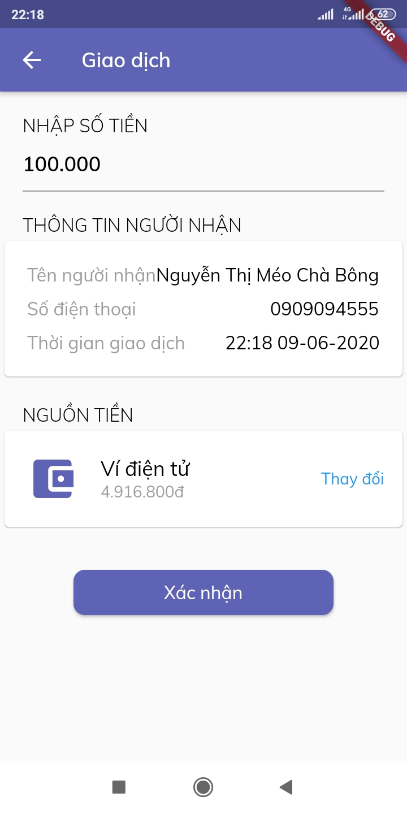

### Nạp, rút tiền

  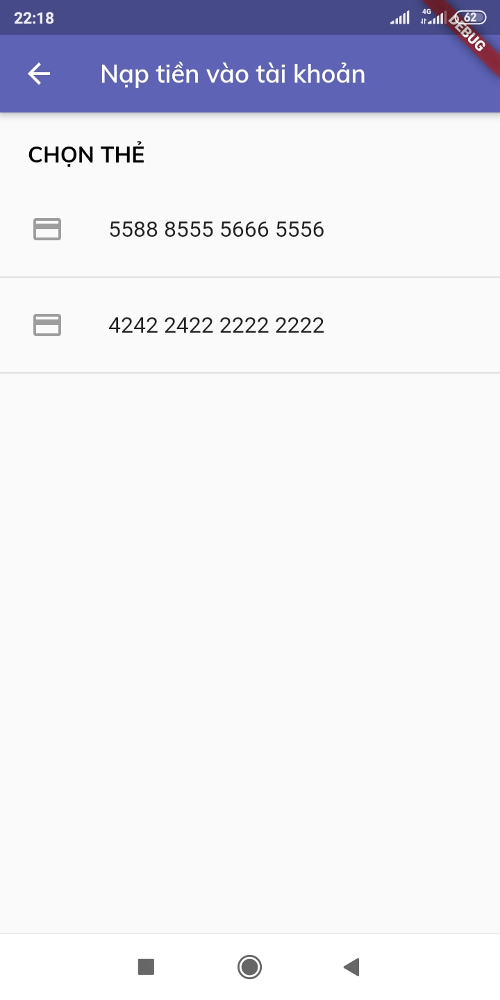
  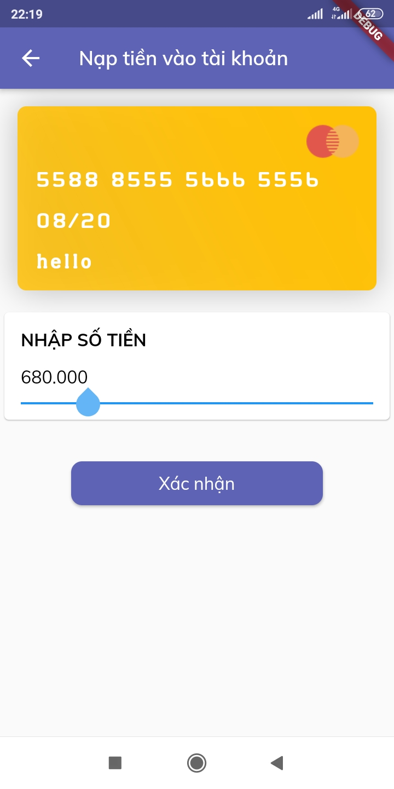

### Chuyển tiền

  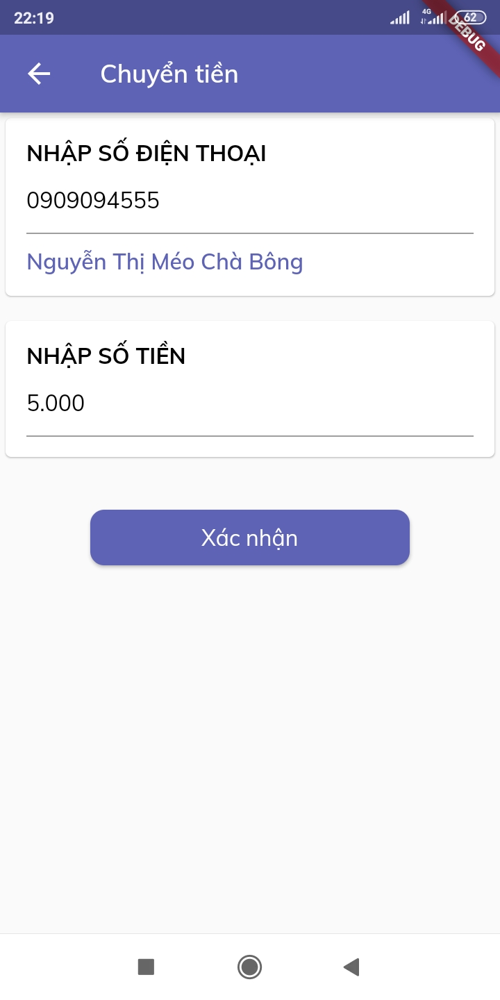

### Quản lý thẻ
* Quản lý thẻ

  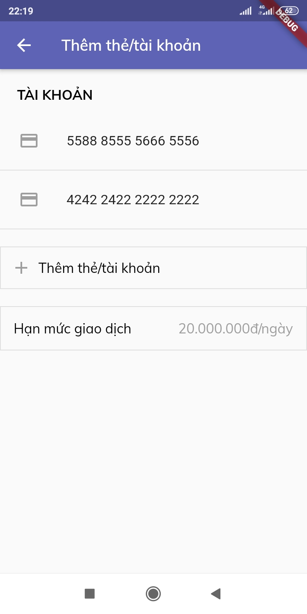

* Nhập thông tin thẻ

  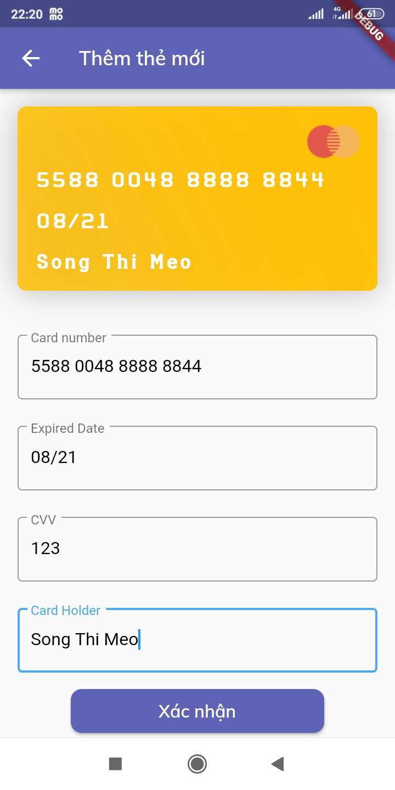

### Lịch sử giao dịch

  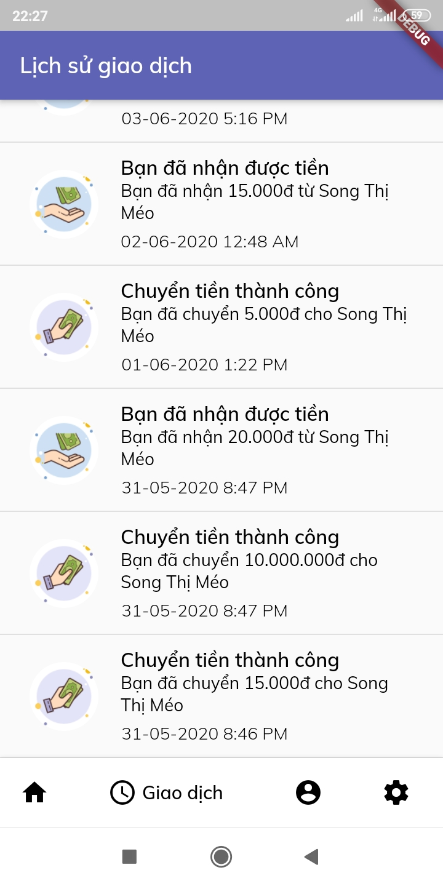

### Thông tin cá nhân

  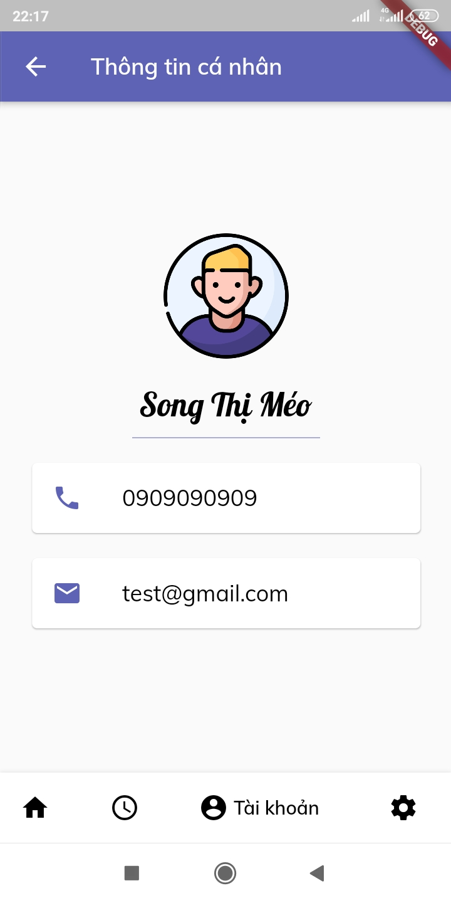

### Các màn hình phụ 
* Thông báo giao dịch thành công

  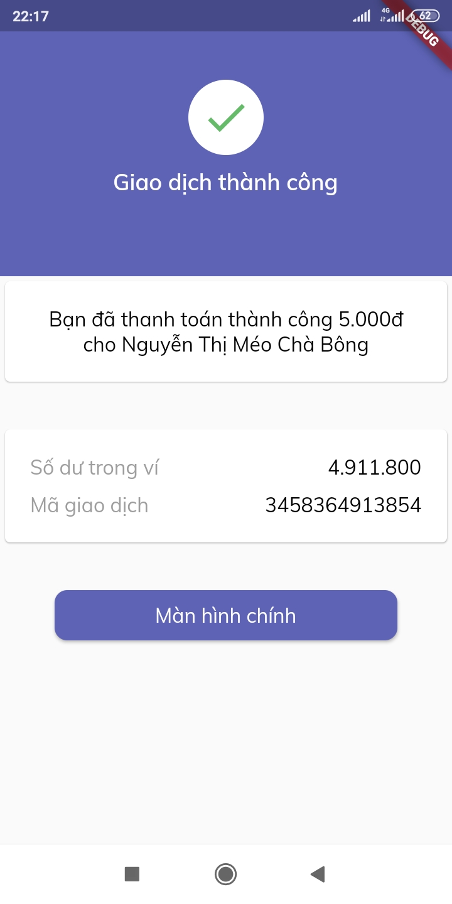

* Yêu cầu xác thực mã PIN

  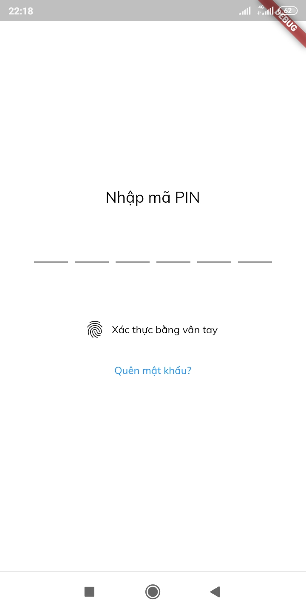

## Yêu cầu thiết bị
* Android:
- Gradle: 5.6.2
- Min Sdk: 21
- Target Sdk: 29

## Thư viện và công nghệ
* Ngôn ngữ: Dart
* Framework: Flutter
* Database: Firebase

## Tác giả
* Bùi Xuân Nhã - 17520834@gm.uit.edu.vn
* Nguyễn Thị Kim Phương - 17520927@gm.uit.edu.vn
